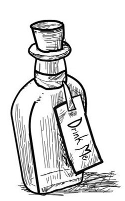

# ~ vial: a micro micro-framework ~

**Vial** is a small web "framework" for making small web sites.

It includes just a few basics:

- Parsing and routing HTTP requests
- Parsing POST form data
- Serving static files (css, js)

Everything else... well, that's up to you.

The goal is an as-few-as-possible-dependencies web library you can
use to test out an idea quickly or get a personal project _rolling_.
Single file, server side apps? You bet! Fast compilation? Yes please!
_À la carte_ dependencies? Now you're talkin'!

It's sort of like a picnic where the playlist is all 90s music and you
have to bring your own beverages. And food.

To learn more, keep reading or visit one of these links:

- [Documentation](https://vial.sh/)
- [API Reference](https://docs.rs/vial)
- [Source Code](https://github.com/xvxx/vial)
- [Examples](https://github.com/xvxx/vial/tree/master/examples)

---

**⚠ Status:** Vial is currently in early development. It is being
developed alongside [deadwiki], but that is _strictly_ for personal
use. Please proceed with caution and wear a hart hat at all times.

---

## ~ getting started ~

To get started, just add `vial` to your `Cargo.toml`:

```toml
[dependencies]
vial-v0.0.12-
```

Now you can `use vial::prelude::*;` in your application to pull in the
common types, or just use the crate like any other.

## ~ hello world ~

As is tradition:

```rust
vial::routes! {
    GET "/" => |_| "Hello, world!";
}

fn main() {
    vial::run!().unwrap();
}
```

For a bit more sanity, you can route to functions directly:

```rust
use vial::prelude::*;

routes! {
    GET "/echo" => echo;
    POST "/echo" => post;
}

fn echo(_: Request) -> &'static str {
    "<form method='POST'>
        <input type='text' name='echo'/>
        <input type='submit'/>
    </form>"
}

fn post(req: Request) -> String {
    format!(
        "<h1>You said: {}</h1>",
        req.form("echo").unwrap_or("You didn't say anything!")
    )
}

fn main() {
    vial::run!().unwrap();
}
```

To _really_ break the mold, you can split your site into different
modules:

```rust
use vial;

mod wiki;
mod blog;

mod index {
    use vial::prelude::*;
    routes! {
        GET "/" => |_| Response::from_file("index.html")
    }
}

fn main() {
    // The order matters here - if `wiki` and `blog` both define "/",
    // the `mod index` version will match first and get run.
    vial::run!(index, wiki, blog);
}
```

But hey, who wants to putz around with HTML when you can be writing
**Rust**? Enable the `horror` feature and you're on your way:

```rust
use vial::prelude::*;

routes! {
    GET "/" => |_| html! {
        p {
            : "You're looking for this: ";
            a(href="/echo") { : "echo" }
        }
    };
    GET "/echo" => echo;
    POST "/echo" => post;
}

fn echo(_: Request) -> impl Responder {
    html! {
        form(method="POST") {
            p {
            : "Type something: ";
                input(type="text", name="echo");
                input(type="submit");
            }
        }
    }
}

fn post(req: Request) -> impl Responder {
    owned_html! {
        h1: req.form("echo")
            .unwrap_or("You didn't say anything!");
    }
}

fn main() {
    vial::run!().unwrap();
}
```

## ~ bonus features ~

**vial** doesn't come with JSON or a template engine or any of that
fancy stuff by default, but there are a few compile-time `--features`
you can activate for enhanced productivity:


- [x] **state**: Global state you set with `vial::use_state!(T)` and
      reference with `request.state::<T>()`.
- [x] **horror**: Enable [horrorshow]: A small & fast macro-based HTML
      builder.
- [ ] **cookies**: Cookie monster!
- [ ] **sessions**: Session support.
- [ ] **uploads**: Multipart form data (file uploads)
- [ ] **log**: Access logging
- [ ] **json**: `to_json` and `from_json` powers, via Serde.

_**Please note:** The list above is a work-in-progress._

## ~ hot reloading ~

Your assets will automatically get reloaded in debug mode, complete
with proper ETag support, but you probably want to refresh your Rust
code, too.

Right now the easiest way is to use [cargo-watch]:

    $ cargo install cargo-watch
    $ cargo watch -x 'run --example hello_world'

## ~ T0D0 ~

- [ ] fix iphone text-size

## ~ testing ~

Tests can be run on a recent version of stable **Rust** with
`make test`. We also run tests on commits with [GitHub
Actions][gh-build-action].

**Vial** prefers to put everything in `tests/` rather than include
tests directly in `src/*.rs` files. To access private APIs in tests,
we make them `pub` and use `#[doc(hidden)]`. Your cooperation is
appreciated.

## ~ license ~

**Vial** is licensed under either of the following, at your option:

- Apache License, Version 2.0, ([LICENSE-APACHE](LICENSE-APACHE) or
  http://www.apache.org/licenses/LICENSE-2.0)
- MIT License ([LICENSE-MIT](LICENSE-MIT) or
  http://opensource.org/licenses/MIT)

[cargo-watch]: https://crates.io/crates/cargo-watch
[horrowshow]: https://github.com/Stebalien/horrorshow-rs
[deadwiki]: https://github.com/xvxx/deadwiki
[gh-build-action]: https://github.com/xvxx/vial/actions?query=workflow%3Abuild
