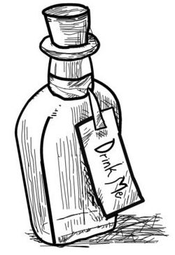

# ~ vial: a micro micro-framework ~

`vial` is a small web "framework" for making small web "sites".

It only includes a few basics:

- Parsing and routing HTTP requests
- Handling POST requests
- Serving static files (css, js)

Everything else... well, that's up to you.

The goal is an as-few-as-possible-dependencies web library you can
use to test out an idea quickly or get a personal project _rolling_.
Single file, server side apps? You bet! Fast compilation? Yes please!
_À la carte_ dependencies? Now you're talkin'!

It's sort of like a picnic where the playlist is all 90s music and you
have to bring your own beverage. And food.

To get started, just add `vial` to your `Cargo.toml`:

```toml
[dependencies]
vial = "*"
```

## ~ hello world ~

As is tradition:

```rust
vial::routes! {
    GET "/" => |_| "Hello, world!";
}

fn main() {
    vial::run!().unwrap();
}
```

For a bit more sanity, you can route to functions directly:

```rust
use vial::prelude::*;

routes! {
    GET "/echo" => echo;
    POST "/echo" => post;
}

fn echo(_: Request) -> &'static str {
    "<form method='POST'>
        <input type='text' name='echo'/>
        <input type='submit'/>
    </form>"
}

fn post(req: Request) -> String {
    format!(
        "<h1>{}</h1>",
        req.form("echo").unwrap_or("You didn't say anything!")
    )
}

fn main() {
    vial::run!().unwrap();
}
```

To _really_ break the mold, you can split your site into different
modules:

```rust
use vial;

mod wiki;
mod blog;

mod index {
    use vial::prelude::*;
    routes! {
        GET "/" => |_| Response::from_file("index.html")
    }
}

fn main() {
    // The order matters here - if `wiki` and `blog` both define "/",
    // the `mod index` version will match first and get run.
    vial::run!(index, wiki, blog);
}
```

But hey, who wants to putz around with HTML when you can be writing
**Rust**? Enable the `horror` feature and you're on your way:

```rust
use vial::prelude::*;

routes! {
    GET "/" => |_| html! {
        p {
            : "You're looking for this: ";
            a(href="/echo") { : "echo" }
        }
    };
    GET "/echo" => echo;
    POST "/echo" => post;
}

fn echo(_: Request) -> impl Responder {
    html! {
        form(method="POST") {
            p {
            : "Type something: ";
                input(type="text", name="echo");
                input(type="submit");
            }
        }
    }
}

fn post(req: Request) -> impl Responder {
    owned_html! {
        h1: req.form("echo")
            .unwrap_or("You didn't say anything!");
    }
}

fn main() {
    vial::run!().unwrap();
}
```

## ~ hot reloading ~

Install [cargo-watch]:

    $ cargo install cargo-watch
    $ cargo watch -x 'run --example hello_world'

## ~ bonus features ~

**vial** doesn't come with JSON or a template engine or any of that
fancy stuff, but there are a few compile-time `--features` you can
activate for enhanced productivity:


- [ ] **cookies**: Cookie monster!
- [ ] **sessions**: Session Support
- [x] **state**: Global State
- [x] **markdown**: Add Markdown rendering capabilities.
- [x] **horror**: Small & fast macro-based HTML builder, via [horrowshow].
- [ ] **json**: `to_json` and `from_json` powers, via Serde.
- [ ] **tera**: Templating, via Tera.
- [ ] **hatter**: Barebones, no-dependency template library, via [hatter].
- [ ] **gzip**: Serve pages with gzip compression.

_**Please note:** The list above is a work-in-progress._

## ~ T0D0 ~

- [ ] tests
- [ ] document each feature in manual
- [ ] don't copy any of raw HTTP request
- [ ] `before_filter`
- [ ] cookies
- [ ] sessions

### warp's features:

- [x] Path routing and parameter extraction
- [x] Header requirements and extraction
- [x] Query string deserialization
- [ ] JSON and [x] Form bodies
- [ ] Multipart form data
- [x] Static Files and Directories
- [ ] Websockets
- [ ] Access logging
- [ ] Gzip, Deflate, and Brotli compression

[cargo-watch]: https://crates.io/crates/cargo-watch
[horrowshow]: https://github.com/Stebalien/horrorshow-rs
[hatter]: https://github.com/xvxx/hatter

